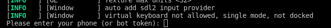
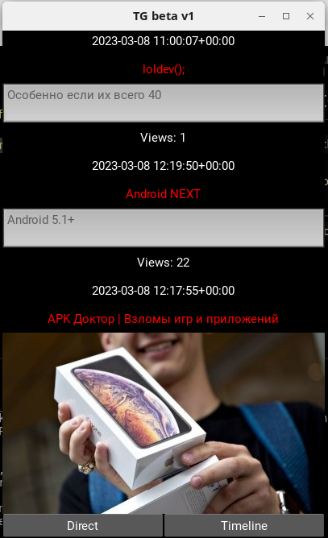
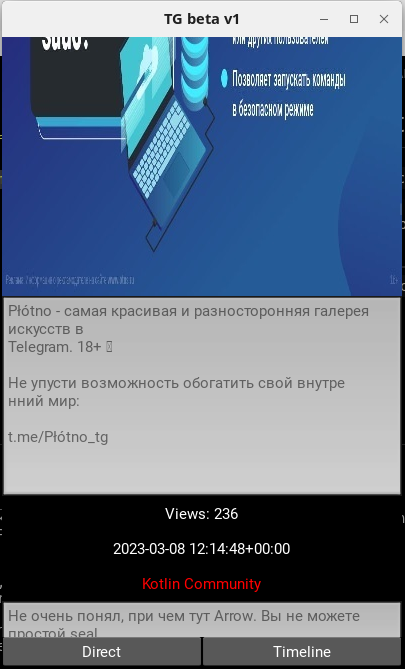

# proto_tg

> requirements
```
python3
kivy
telethon
os
```

> support funcs in app

`WARNING: view only last one message!`

* Timeline
* * sender
  * image
  * text
  * views
  * date
  * time
* Direct
  * sender
  * image
  * text
  * date
  * time
* Cache Timeline
  * image 

***

> used `backend/config.py`
```py
api_id = 989898
api_hash = "cdsv7ydf89vyd8fvrjeknl3kms"
phone = "+79998887766"
PREFIX_PATH_PHOTO = './image_directory/file_photo'

```
***

> launch `program`

``` bash
python main.py
```

***

> log in `telegram account`

`enter phone number`

`enter received code`


***

> Demo screen `timeline`
 

***

***